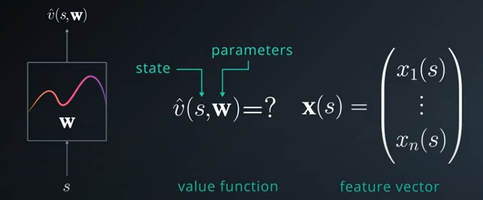

# Deep_Reinforcement_learning_Banana_environment
The project focusses on training an agent to collect bananas of particular color in a grid based environment developed in Unity. The agent is trained using 
deep reinforcement learning algorithms Deep Q learning. The agent gets data about its current state from the environment through the sensor readings which is of 37 dimensional. 
There is only one agent in this environment and it has 4 actions space which is of Up, Down, Left and Right movements. The agent get a reward of +1 collecting an yellow banana and 
a reward of -1 for collecting blue banana. The goal of the agent is to collect as many yellow bananas as possible. The task is episodic and comes to end after agent fails. The agent needs to get and average score of +13 to solve the environment.


<h2> Model </h2>

<p> We use the Deep Reinforcement learning approaches to solve the environment. The Q learning algorithm combined with the Neural Network produces the Deep Q Network. This network is trained by using Mean Squarred loss function to solve the environment.

<h3> Q learning </h3>
<p>  The Q learning algorithm uses a Q table which contains both states and actions and the value corresponding to each state action pair.Each time the agent chooses an action which has maximum value among the actions of a particular state. In Monte Carlo based control approaches,the agent updates its Q value only when the episode is completed. Sometimes the episode may take very large time and instead of waiting to update the Q table, we  use temporal difference approach to update the Q table after each action.

The Q table for TD control Q learning (SarsaMax) is updated using the below equation

Q(S1,A1) = Q(S1,A1) + alpha * (Reward2 + gamma * max(Q(S2,a) for all actions) - Q(S1,A1))

Here alhpa determines the learning rate of updating the Q table. For updating the Q value of the state S1 and action A1, we use the Q(S1,A1),reward obtained after performing the action A1 (Reward2) and the Q value of next state and maximum probable action in that state. Here we try to reduce the difference between the current estimate Q(S1,A1) and the alternative estimate (Reward2 + gamma * max(Q(S2,a) for all actions)).


<p> Here is Gt is the expected return after an episode in MC control method while in TD method we use the expected return after each action.</p>

<h3> Discretization </h3>

<p> In order to deal with a environment which is continuous we discretize into a grid to apply Q learning. But the problem is that the state space is very large and so discretization won't be of much help. So we use function approximation here. Here the state space is repesented as a 37 dimensional feature vector and contains agent's velocity along with ray based perception of the objects. Here we only use the 37 dimensional values and we ignore the images.</p>

<h3>Function approximation </h3>

<p> When the state space is very large and complicated, the number of states after discretization becomes very large and so we loose the advantages of discretization. For positions is the nearby states, the values are very much similar and smoothly changing. Discretization doesn't exploit this characteristic failing to generalize well across the state space. The true state value function V_pi or action value function Q_pi are typically smooth and continuous. Capturing this completely is practically infeasible except for some simple problems. So our best hope is function approximation.</p>

<p> So we introduce a parameter vector w to shape the function. These w are learned by optimization algorithms to get the desired approximation. The appoximation can map a state to value or a state action pair to corresponding Q value. In our case we use the function approximation to map the state action pair to corresponding Q value,since we need our agent to take actions in an unknown environment. We first use a Linear function approximation by converting the state space to a set of feature vectors and we tune the weights to get the desired approximation. The feature vector is dot product with the weights to get the desired Q value function.</p>




<h3> Gradient descent </h3>

<p> We need to minimize the difference between true value function V_pi and the approximation value function which we obtained through the dot product. To minimze the mean square error function we differentiate with respect to the weights the loss function and equate it to 0. But for complex problems solving the differential equations can become very painful and so we use gradient descent optimization algorithms.</p>


<p> We now use this update rule to apply gradient descent by plugging in random values of w initially and then optimizing the weights so that the we reach the minimum point in the loss curve. The parameter alpha denotes the learning rate.</p>

<h3> Action Vector Approximation </h3>

<p> Previously we computed a single action for each state.So we need to reiterate to get the action value function for all possible actions for a particular state. We can now optimize this by computing the action vector which computes all the action values for a state at once. </p>


<p>Here we extended our weight vector to a matrix where each column emulates a separate linear function but common features brings the correlation between columns.This parallel processing enables faster computation.</p>

<h3>Non Linearity </h3>

<p> The main problme with the above function approximation is that it can only handle linear relations. Most of the natural processes are non linear. So apply a non linearity to our previous dot product computation so as to capture the non linear relations. We can use sigmoid or relu or other activation functions for this purpose. </p>

<h3> Experience Replay training technique </h3>

<p> Previously for each state we perform action, learn from the rewards and then discard the values moving onto next state.But some states may occur very rarely and the actions performed in those states may ber very much crucial. So discarding them is not a good option. So we store the state action experiences in a replay buffer and then learn from this buffer. This Naive Q learning approach runs in the risk of getting stuck by effects of correlations between the sequence of experienced tuples in this buffer. The agent may be biased to certain set of action for a certian set of states and stops exploring the remaining states.</p>

<p> To solve this we can use experience replay. Instead of learning each step, we first allow the agent to explore the environment and get the experiences in a replay buffer. The agent may randomly choose an action for a random state and can explore the environment very well. After sometimes when we get a batch of experiences we now train our agent by randomly choosing the samples from the replay buffer to avoid any correlation.</p>

<h3> Fixed Q targets </h3>

<p> The other problem in the Q learning is that from the update equation we have a correlation between the target and the parameters which the agent is learning. We have the weights which approximate the action value function Q and we use this action value function to update the weights of Q. Thus we a chasing a moving target which is not efficient learning approach. So to solve this problem we use a Fixed Q target function and we use this to find the MSE between the local and target network. After few steps of training we update the target network using the local network. We perform soft update of the target network perventing any drastic changes from the local network.</p>


where W minus is the weights of the fixed target network.

<h3> Deep Q learning algorithm </h3>


<h2> Implementation </h2>

<p> The model uses 2 Linear layers with a Relu activation function. The input state feature vector is passed to the network and the final third linear layer provides the Q value for the 4 possible actions. We use a batch size of 64 and update the target Q network every 4 iterations. The model is trained for 2000 episodes with an average score of  14.14.</p>

```
//Download the ML agents for banana environment from the repo
https://github.com/Unity-Technologies/ml-agents/blob/main/docs/Learning-Environment-Examples.md#banana-collector

move to the path
jupyter notebook Navigation.ipynb

```

<h3> For testing in local environment </h3>

```
Install anaconda python

Create new conda environment
conda create -n ml-agents python=3.6
conda activate ml-agents

Install Cuda toolkit and CuDNN library
Cuda 11.2.2
cuDNN 8.1.0

pip install tensorflow-gpu
conda install pytorch torchvision torchaudio cudatoolkit=11.0 -c pytorch
pip install unityagents
pip install mlagents

move to the path
jupyter notebook Navigation.ipynb

```

<h2> Results </h2>

<h3> Training </h3>


<h2> Testing </h2>

<p> To test the model,Start execution from "#Testing" code Block. The simulator can run only once each time the kernel is opened as once the environment is clsoed the port is removed. So each time we need to restart kernel and run.</p>

```
Video link 
https://youtu.be/FGR21U1rhLI

```

<h2> Further Improvements </h2>

<p> Sometimes the agent fails very badly in some states. This means that some states are not well explored. We can further train the model to some more epochs or use prioritized experience replay to give more priority to rare states. Here in this approach we have ignored the images of the camera from the agent. So in future we can also include that to produce more sophisticated agent.</p>

